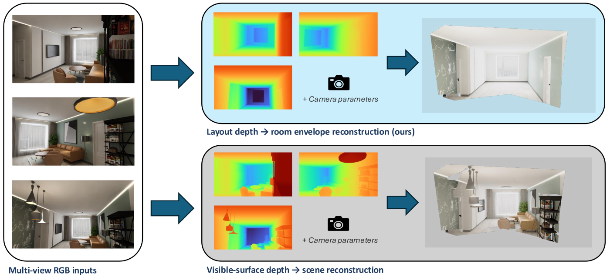

# LayoutLens: Feed-Forward Room Envelope Reconstruction from RGB Images

LayoutLens adapts a feed-forward multi-view 3D vision model for dense amodal
room-envelope reconstruction from RGB images. It predicts structural room
geometry, such as walls, floors, and ceilings, rather than ordinary
visible-scene depth. The structural surface is recovered even where it is hidden
behind furniture and clutter, which makes the prediction amodal.

This repository is a research prototype released alongside an undergraduate
thesis. It contains the model code, training pipeline, configuration files, and
evaluation suite. Datasets are not redistributed, and the model checkpoints are
being uploaded to external hosting (see
[Data and checkpoints](#data-and-checkpoints)).

Note: this is a research artifact, not a production system. Results were
obtained from single-seed experiments and should be read as trends rather than
statistically significant effects.

<p align="center">
  
  <br>
  <em>Given one or more RGB views, the goal is to predict the structural room
  envelope, including the regions occluded by furniture or other objects.</em>
</p>

## Overview

The room envelope is the structural shell of a room: its walls, floor, ceiling,
and the doors and windows set into them, taken behind the furniture and clutter
that hide much of it. Recovering this shell is useful for robot navigation,
augmented reality, and indoor measurement, where the boundaries of the space
matter more than the objects inside it.

The task is amodal because, for many pixels, the structural surface is not
directly visible and must be inferred. This separates it from ordinary
visible-surface reconstruction and monocular depth prediction, which target only
the surfaces the camera can see.

LayoutLens starts from a multi-view feed-forward 3D foundation model
([VGGT](https://github.com/facebookresearch/vggt)), which already turns one or
more images into dense geometry without known camera parameters, and adapts it
to predict the room envelope. The adaptation adds a learned **layout-depth
head** and fine-tunes the deepest blocks of the backbone. Several auxiliary
signals and one architectural module are studied as ablations, and the learned
predictor is compared against classical layout-fitting baselines applied to the
same points.

## Method

The pipeline is summarised as:

```text
RGB views ──▶ VGGT-based backbone ──▶ layout-depth head ──▶ unproject ──▶ 3D room envelope
                       │
                       ├─▶ layout-mask head      (auxiliary)
                       ├─▶ surface-normal head    (auxiliary)
                       └─▶ camera head            (auxiliary)
```

The core components are:

- **VGGT-based backbone.** A multi-view feed-forward aggregator that produces
  dense per-view features from one or more RGB images without requiring known
  cameras.
- **Layout-depth head.** A dense prediction head trained to regress the depth of
  the first *structural* surface along each camera ray, including occluded
  structure. Unprojecting layout depth yields the reconstructed room shell.
- **Partial backbone fine-tuning.** The deepest transformer blocks of the
  backbone are unfrozen and trained at a small learning rate, while the rest of
  the backbone stays frozen.
- **Auxiliary supervision (ablations).** Layout-mask supervision,
  surface-normal supervision, camera supervision, and a planar-consistency
  prior on the predicted layout depth.
- **Mask-gated cross-view attention (ablation).** An attention module on the
  layout-depth path that lets views exchange information, optionally with an
  epipolar attention bias.
- **Classical fitting baselines.** RANSAC plane, Manhattan, and cuboid fitting
  applied to the same predicted points, used as comparison points for the
  learned head.

A short description of the model variants studied in the thesis, and how they
map to configuration files, is given in [docs/configs.md](docs/configs.md).

### Summary of findings

The thesis that accompanies this code reports the following, from single-seed
experiments:

- Adding the learned layout-depth head and fine-tuning part of the backbone
  roughly halves the reconstruction error of the unadapted model.
- Most of that reduction comes from the trained layout-depth head, with
  fine-tuning the later backbone blocks providing an additional gain.
- The learned head is more accurate than the classical plane, Manhattan, and
  cuboid fitting baselines, even when those baselines are tuned per scene
  against the ground truth.
- The auxiliary signals (mask, normal, and camera supervision, the
  planar-consistency prior, and the cross-view attention module) give marginal,
  mixed, or slightly negative effects.
- The occluded part of the room shell remains substantially harder to recover
  than the visible part, and marks the part of the task that is still open.

## Repository structure

```text
LayoutLens/
├── README.md
├── LICENSE                 # VGGT License (covers the whole repository)
├── NOTICE                  # provenance and attribution
├── CITATION.cff
├── CONTRIBUTING.md
├── pyproject.toml          # installable packages: vggt, room_envelopes
├── requirements.txt
├── train.py                # training entry point (delegates to training/launch.py)
├── vggt/                   # VGGT backbone + prediction heads (layout depth, mask, normal, camera, cross-view attention)
├── room_envelopes/         # dataset I/O, depth decoding, extrinsics, env-var path config
├── training/
│   ├── config/             # Hydra YAML configs (see docs/configs.md)
│   ├── data/               # datasets, dataloaders, augmentation
│   ├── geometry/           # plane/cuboid fitting + post-processing
│   ├── train_utils/        # optimizer, layer freezing, checkpoints, logging
│   ├── cache/              # seed-pinned eval manifests (regenerated locally; not shipped)
│   ├── trainer.py
│   ├── launch.py
│   ├── loss_room_envelope.py
│   └── eval_metrics.py
├── evaluations/            # 2D + 3D evaluation, N-view orchestrator, tests
├── scripts/                # example train/eval shell wrappers
├── docs/                   # dataset, training, evaluation, configs, reproducibility
├── assets/                 # teaser and documentation figures
└── examples/               # usage notes
```

`vggt` and `room_envelopes` are installable packages. `training/` is added to
`sys.path` at runtime (the trainer imports modules such as `trainer` and
`geometry` directly), so it is not a package; always launch through `train.py`
or `pytest` from the repository root.

## Installation

Requires Python >= 3.10. A CUDA-capable GPU is required for training and for GPU
evaluation.

```bash
git clone https://github.com/ar-gitcode/LayoutLens.git
cd LayoutLens

python -m venv .venv && source .venv/bin/activate
pip install -e ".[train,dev]"      # or: pip install -r requirements.txt
```

The training extra pins `torch==2.3.1` and `torchvision==0.18.1`; adjust these
to match your CUDA toolkit if needed.

## Data and checkpoints

- **Datasets** are not redistributed with this repository. The experiments use
  the **Room Envelopes** dataset
  ([Bahrami and Campbell, 2025](https://arxiv.org/abs/2511.03970)); obtain it
  from its original source under its own license.
- **Checkpoints** (the VGGT initialization weights and one trained checkpoint per
  experiment) are being uploaded to external hosting, since the files are large
  and a suitable platform is being arranged. A download link will be added once
  it is available. The full list of checkpoint files and how to use them is in
  [docs/checkpoints.md](docs/checkpoints.md).

All external paths are resolved through environment variables (with placeholder
defaults that must be set), so no code or config edits are needed to relocate
data:

| Environment variable | Purpose |
| --- | --- |
| `ROOMENV_DATA_DIR` | Room Envelopes dataset root |
| `ROOMENV_DATA_WDS_DIR` | Extracted WebDataset shards (defaults under `ROOMENV_DATA_DIR`) |
| `ROOMENV_EXTRINSICS_MANIFEST` | Dataset extrinsics manifest |
| `ROOMENV_WEIGHTS_DIR` | VGGT base / layout-init checkpoints |
| `ROOMENV_EVAL_CACHE_DIR` | Seed-pinned eval-manifest JSONs |

```bash
export ROOMENV_DATA_DIR=/path/to/datasets/room_envelopes
export ROOMENV_WEIGHTS_DIR=/path/to/weights
```

See [docs/dataset.md](docs/dataset.md) for the full dataset preparation guide,
including the depth-decoding convention.

## Training

The training entry point is `train.py`, which loads a Hydra config by name from
`training/config/`.

```bash
# Single GPU: layout-depth head with the last 12 backbone blocks unfrozen
python train.py --config room_envelopes/e1b_uf12_layout_depth_only_original_regression

# Multi-GPU: layout head + mask supervision + mask-gated cross-view attention
torchrun --nproc_per_node=4 train.py \
    --config room_envelopes/e2a_uf12_layout_depth_mask_oca_original_regression
```

`--config` is a config name without the `.yaml` suffix, resolved against
`training/config/`. Configuration files keep their original short identifiers;
[docs/configs.md](docs/configs.md) maps each one to the readable experiment name
used in the thesis (for example, *Layout head, last 12 blocks unfrozen* or
*Mask-gated cross-view attention*). Weights-and-Biases logging is disabled by
default and can be enabled per config. See [docs/training.md](docs/training.md)
for details.

## Evaluation

The evaluation suite writes JSON metrics only. The 2D and 3D entry points are
separate, with an N-view orchestrator at the top of `evaluations/`.

```bash
# 2D metrics (layout depth / mask / normals) for one experiment
python evaluations/src/2d/eval_2d.py run \
    --experiment e1c_uf12_layout_depth_mask_original_regression \
    --checkpoint /path/to/checkpoint.pt

# 3D room-envelope reconstruction (unproject layout depth, compare to GT shell)
python evaluations/src/3d/eval_room_envelope_reconstruction.py \
    --config room_envelopes/e1b_uf12_layout_depth_only_original_regression \
    --checkpoint /path/to/checkpoint.pt \
    --output_dir ./eval_out/reconstruction \
    --camera_mode gt

# N-view orchestrator (1 to 5 input views)
python evaluations/eval_all_nview_manifests.py \
    --config room_envelopes/e1b_uf12_layout_depth_only_original_regression \
    --checkpoint /path/to/checkpoint.pt \
    --output-dir ./eval_out/nview
```

Reconstruction is evaluated under scale-aligned and scene-normalised settings,
with camera poses taken either from ground truth (`--camera_mode gt`) or decoded
from the model's own camera predictions (`--camera_mode pred`). See
[docs/evaluation.md](docs/evaluation.md) for the metric definitions and
alignment options.

## Expected outputs

- **Training** writes checkpoints and logs under `training/logs/<experiment>/`
  (git-ignored). The best checkpoint is saved as `best.pt`.
- **Evaluation** writes JSON metrics under the chosen output directory. The 3D
  reconstruction script writes a `metrics_summary.json`; the 2D script writes a
  per-experiment JSON under `<output-dir>/<split>/`. Both can optionally emit
  point-cloud PLY files for inspection.

## Reproducibility

The dataset splits used for evaluation are fixed by seed-pinned manifests. The
manifest files themselves are regenerated locally rather than shipped; see
[docs/reproducibility.md](docs/reproducibility.md) for the exact regeneration
commands, the random seeds used, and the pinned dependency versions.

## Citation

If you use this code, please cite the accompanying thesis. See
[CITATION.cff](CITATION.cff) for machine-readable metadata.

```bibtex
@thesis{raj2026layoutlens,
  title  = {LayoutLens: Feed-Forward Room Envelope Reconstruction from RGB Images},
  author = {Raj, Arjun},
  year   = {2026},
  type   = {Undergraduate thesis},
  school = {The Australian National University},
  note   = {COMP4550 research project}
}
```

This work builds directly on VGGT and on the Room Envelopes formulation; please
cite those works as well:

```bibtex
@inproceedings{wang2025vggt,
  title     = {VGGT: Visual Geometry Grounded Transformer},
  author    = {Wang, Jianyuan and Chen, Minghao and Karaev, Nikita and Vedaldi, Andrea and Rupprecht, Christian and Novotny, David},
  booktitle = {Proceedings of the IEEE/CVF Conference on Computer Vision and Pattern Recognition (CVPR)},
  year      = {2025},
  note      = {arXiv:2503.11651}
}

@article{bahrami2025roomenvelopes,
  title   = {Room Envelopes: A Synthetic Dataset for Indoor Layout Reconstruction from Images},
  author  = {Bahrami, Sam and Campbell, Dylan},
  year    = {2025},
  journal = {arXiv preprint arXiv:2511.03970}
}
```

## Acknowledgements

This project adapts [VGGT](https://github.com/facebookresearch/vggt) by Wang et
al. (CVPR 2025). The `vggt/` directory is derived from the VGGT codebase, with
prediction heads and a cross-view attention module added for room-envelope
prediction. The experiments use the Room Envelopes dataset by Bahrami and
Campbell (2025). The work was carried out as a COMP4550 research project at The
Australian National University.

## License

LayoutLens is released under the **VGGT License** (see [LICENSE](LICENSE)),
reproduced from the [VGGT project](https://github.com/facebookresearch/vggt) by
Meta Platforms, Inc. The repository contains code derived from VGGT (under
`vggt/`, which retains the original Meta copyright headers) together with
original code, configuration, and documentation by the author; all of it is
distributed under the VGGT License. See [NOTICE](NOTICE) for provenance and
attribution.

Datasets are not redistributed here and remain governed by their own licenses.
Model checkpoints are distributed separately (see
[docs/checkpoints.md](docs/checkpoints.md)); they are derived from VGGT model
weights and are subject to the VGGT License. They were fine-tuned from the
original VGGT-1B weights, which are licensed for non-commercial use, so the
released checkpoints are **for non-commercial use only**.
